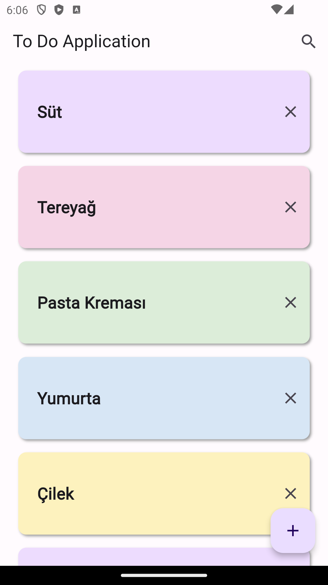

# odev7

Todo List App

## App Details

This application was built with mvvm architecture and the flutter_bloc library was used as state management. Sqflite was used to store and retrieve data.

## App Images

